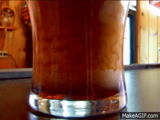

# pintflow

3D parallel solver (C++/CUDA/MPI) reproducing Guinness’s famous sinking-bubble cascade in pint glass geometry

This project will implement a lattice Boltzmann (LBM) fluid solver coupled with Lagrangian bubble particles, accelerated with CUDA and distributed across multiple GPUs with MPI. The goal is to reproduce the physical mechanisms reported in published studies while also building a high-performance solver that can explore how different parameters affect the cascade.

  

### Background

When you pour a pint of Guinness, it looks like the bubbles are sinking instead of rising. That feels backwards, since bubbles are buoyant, but the effect comes from a few things working together. First, the pint glass shape matters: because it narrows at the bottom, it sets up a circulation pattern where liquid moves downward along the walls and upward in the center (a fluid behavior similar to the Boycott effect).

Next, Guinness doesn’t just use CO₂, it uses a nitrogen–CO₂ mix. The nitrogen makes the bubbles really small (~50–100 μm), and small bubbles rise very slowly (just a few mm/s). Since the downward wall flow is stronger than their buoyancy, the bubbles get carried down, making it look like they’re sinking.

Finally, experiments show that the famous cascade only shows up if the glass wall is tilted at just the right angle (~5–20°). In that range, the flow becomes unstable, and the bubbles line up into wave-like bands that travel downward at about 35 mm/s. Put all that together, glass shape, microbubble physics, and flow instability and you get the iconic Guinness cascade.
### Status

Working on first milestone: baseline CPU LBM solver with pint vs anti-pint flow direction test.

### Project Goals
- Reproduce published physics results: validate against experimental work on pint vs anti-pint flow, bubble size dependence, tilt thresholds, and cascade wave speed.
- Build a high-performance solver: implement LBM + bubble coupling in C++/CUDA with MPI domain decomposition, optimized for single and multi-GPU runs.
- Enable parameter exploration: design the solver as a reproducible research tool, with configs and automated sweeps to test how geometry, tilt, bubble size, and concentration affect the cascade.
- Benchmark scaling: measure CPU vs GPU performance and MPI scaling (strong and weak), with the goal of demonstrating near-linear speedups across multiple GPUs.
- Produce visualizations: generate ParaView and Blender outputs that make the cascade visible, both for validation and presentation.
- Document findings: provide clear analysis, scaling plots, and comparisons to published data in the repo 

### Background & references
- [Benilov, Cummins, Lee (2013): Why do bubbles in Guinness sink? Am. J. Phys. 81, 88.](https://eugene.benilov.com/pubs/ajp13.pdf)
- [Watamura et al. (2019): Bubble cascade in Guinness beer is caused by gravity-current instability. Sci. Reports 9, 5718.](https://www.nature.com/articles/s41598-019-42094-0)
- [Alexander & Zare (2004): Do bubbles in Guinness go down?](https://web.stanford.edu/group/Zarelab/guinness/index.html)
- [C. E. Brennen (2005): Fundamentals of Multiphase Flows, Cambridge University Press.](https://brennen.caltech.edu/INTMult/multbook.pdf)
- [Peacock, Blanchette & Bush (2005): Stratified Boycott Effect, J. Fluid Mech.](https://math.mit.edu/sites/bush/wp-content/uploads/2012/04/stratified_Boycott.pdf)
- [Hu et al. (2023): Multiphase Flow with Bubbles, Springer.](https://www.springer.com/book/9783031992155?srsltid=AfmBOoqi92A_ZAwOFfq-yXAtU6iGQ8LKgWSkmGxMHji9uMOdRl7oP8bd)

### License
MIT, see LICENSE. “Guinness” is a trademark of Diageo. This project is unaffiliated.